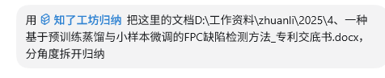
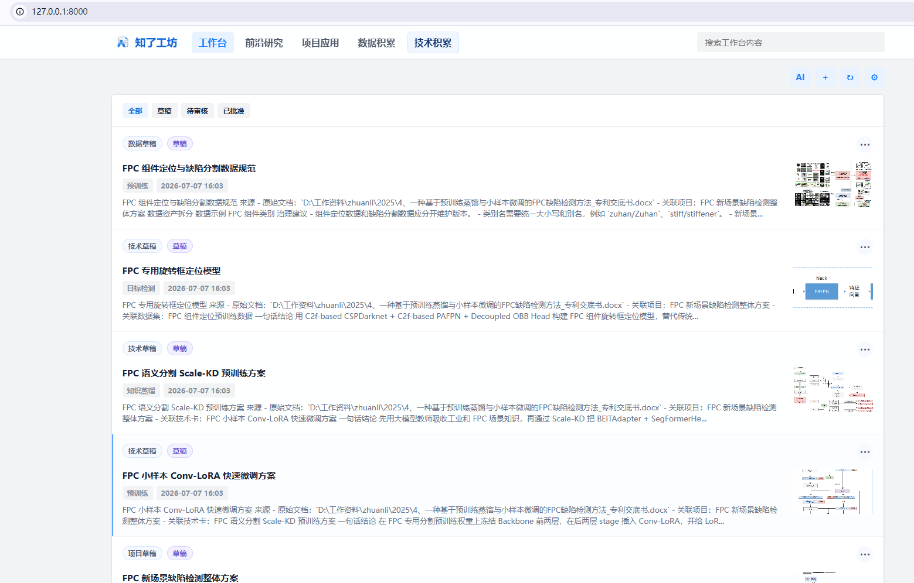

# 知了工坊


------

## Quick Start

**step1:**

```
git clone https://github.com/suyan451/zhiliao.git
```

**step2:**

```
基于项目路径新建codex/claude code 会话/工程，安装skills/industrial-knowledge-intake

重启codex/claude code，识别新安装技能
```

**step3:**

```
本地运行服务

python3 scripts/serve_frontend.py --no-build

本地浏览器打开

http://127.0.0.1:8000
```

**step4:**

技能可通过输入 /知了 呼出

```
/知了 
```

在codex/claude code进行对话：





## 特性：

（1）知了 会把文档按您关注的技术方向进行梳理归纳，形成AI可检索的md格式的知识库。

（2）您可以在codex / claude code里设置 指定个人日常研发主线相关的、定期的 论文检索归纳，再自动调用知了工坊，管理论文粗读、精读、验证的生命周期；

（3）您可以直接基于git维护知识文档。


欢迎使用 知了工坊，积累您的个人研发知识库~
